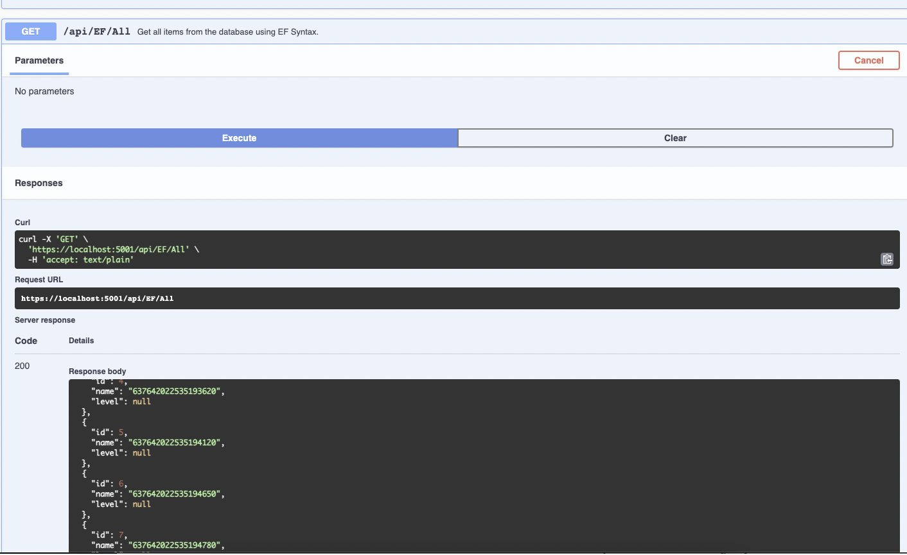

=======
To run this sample, edit [appsettings.json](AspNetCoreDatabaseIntegration/appsettings.json) and **set your DSN** to see the events in Sentry.
You may also need to edit your Data Source Ip and port, user id and password if using a database different than localdb.

Tested on:
* Windows 10 Build 19042 with LocalDB
* MacOS Big Sur with SQL Server.

We recommend testing it with the Docker version of SQL Server for in case the default setup doesn't work.

## Docker SETUP

TL;RD command
```Bash
docker run -e "ACCEPT_EULA=1" -e "MSSQL_SA_PASSWORD=MyPass@word" -e "MSSQL_PID=Developer" -e "MSSQL_USER=SA" -p 1433:1433 -d --name=sql mcr.microsoft.com/azure-sql-edge
```
more information at: https://medium.com/geekculture/docker-express-running-a-local-sql-server-on-your-m1-mac-8bbc22c49dc9


You'll also need to edit your DefaultConnection on [appsettings.json](AspNetCoreDatabaseIntegration/appsettings.json) to change the database address and credentials.

```xml
"DefaultConnection": "Data Source=127.0.0.1;User Id=sa;Password=MyPass@word;Database=SampleAspNetWithEfCore;Trusted_Connection=False;ConnectRetryCount=0;MultipleActiveResultSets=True"
```
You may also change the source ip according to the database location.

## Running the Demo
1. Configure your DSN in [appsettings.json](appsettings.json)
3. Run.
4. Execute the different endpoints presented on swagger that integrates EF Core and SQLClient, each endpoint will generate a new Transaction that will be shown at your ORG performance monitoring.


### In this sample we demonstrate the following:

* Initialize the SDK via the ASP.NET Integration (Program.cs UseSentry())
* Configure the SDK via the framework configuration system (appsettings.json, env var, etc)
* Capture the performance data of HTTP requests (`Startup.cs#UseSentryTracing()`)
* Automatic Integration of SQLClient and Entity Framework Core enriching the transactions with valuable information.
* Including the request payload with the event (done via appsettings.json `IncludeRequestPayload`)

## Screenshots 
